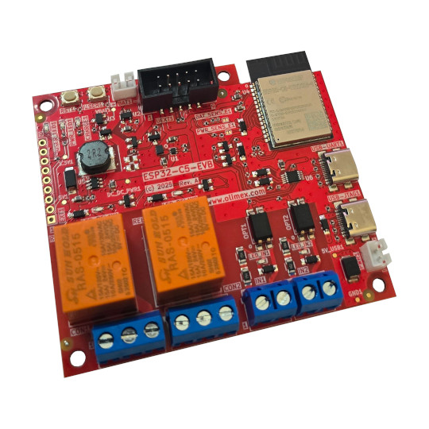

# ESP32-C5-EVB

Development board for dual band 2.4G and 5Ghz WiFi 6, Bluetooth 5 LE, Zigbee, Thread, Matter development board with Relays, optoisolated inputs and LiPo battery UPS

https://www.olimex.com/Products/IoT/ESP32-C5/ESP32-C5-EVB/open-source-hardware

## Licensee
* Hardware is released under CERN Open Hardware Licence Version 2 - Strongly Reciprocal
* SOFTWARE is released under MIT Licensee
* Documentation is released under CC BY-SA 4.0